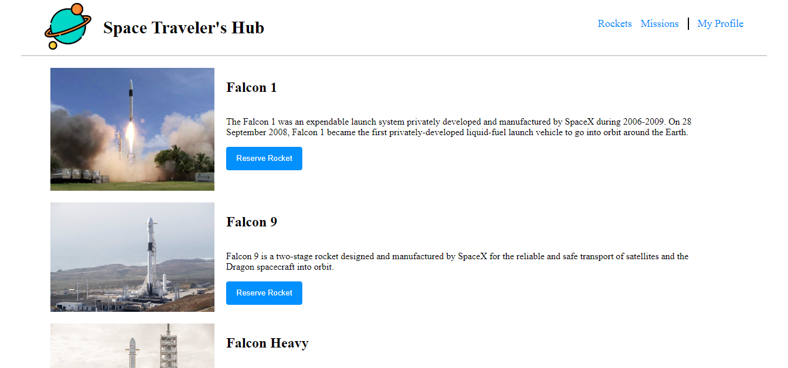
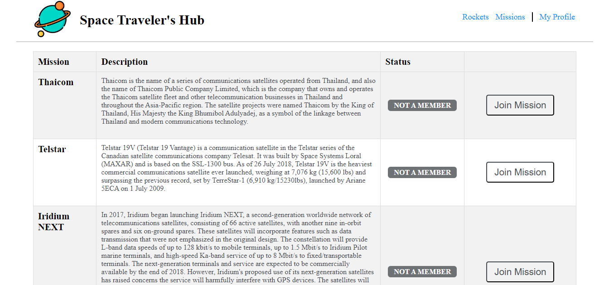
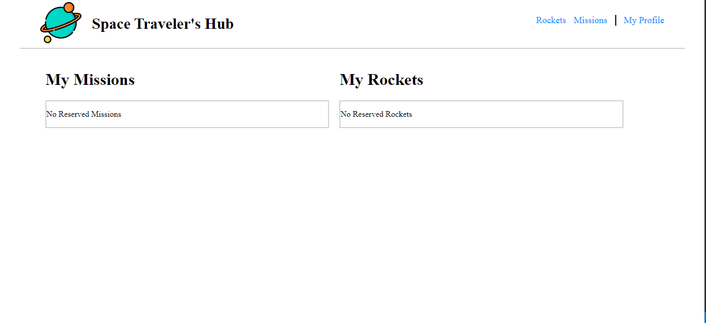

# Space Traveler's Hub

## Description

In this project, we work with a real live data from the SpaceX API to build a web application for a company that provides commercial and scientific space travel services. This application also allows users to book rockets and join selected space missions.

## Requirements for this project

Please find the requirements for this project [here](https://github.com/microverseinc/curriculum-react-redux/blob/main/group-project/project_space_travelers_hub.md).

## screenshots
Rockets Page

Missions Page

Profile Page

## Technologies

- HTML
- CSS & SASS
- JS (ES6)
- React
- Redux
- JEST & React testing library

## Live Demo
You can find the live demo on [Netlify](https://starlit-kashata-f9136c.netlify.app). 

## Authors

👤 **Happen Mathebula**

- GitHub: [https://github.com/HSMathebula](https://github.com/HSMathebula)
- LinkedIn: [www.linkedin.com/in/happen-sipho-mathebula](www.linkedin.com/in/happen-sipho-mathebula)
- Twitter: [https://twitter.com/HappenSipho](https://twitter.com/HappenSipho)
- Email: [mathebulahappen8@gmail.com](mailto:mathebulahappen8@gmail.com)

👤 **Emmanuel Paul**

- GitHub: [https://github.com/Epaltechs](https://github.com/Epaltechs)
- LinkedIn: [https://www.linkedin.com/in/emmanuel-s-paul](https://www.linkedin.com/in/emmanuel-s-paul)
- Twitter: [https://twitter.com/@emmapaul247](https://twitter.com/@emmapaul247)
- Email: [emmapaul247@gmail.com](mailto:emmapaul247@gmail.com)

## 🤝 Contributing

Contributions, issues, and feature requests are welcome!

Feel free to check the [issues page](../../issues/).

## Show your support

Give a ⭐️ if you like this project!

## Acknowledgments

- Hat tip to anyone whose code was used
- Inspiration
- etc

## 📝 License

This project is [MIT](LICENSE) licensed.
